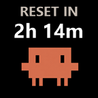

# soomfon-claude-usage

A tiny StreamDock plugin that shows your Claude Code rate-limit usage on a key of a
[Soomfon Stream Controller](https://soomfon.com/products/soomfon-stream-controller-se-with-6-macro-keys-dashboard-customizable-lcd-buttons-white) (or any
device running Soomfon/HotSpot/Mirabox "Stream Controller" software — they're the
same plugin ecosystem under the hood).

The key rotates through three slides every 5 minutes (or immediately on a press):

| 5h left | 7d left | reset countdown |
| --- | --- | --- |
|  |  |  |

- **5H LEFT** — % remaining in Anthropic's rolling 5-hour usage window
- **7D LEFT** — % remaining in the weekly (7-day) usage window
- **RESET IN** — countdown to whichever window resets soonest

No API calls, no extra network traffic: this data already arrives in Claude Code's
normal responses and gets passed to a status line script on every render. This
plugin just reads a small local cache file that script writes.

## How it works

Stream Controller / StreamDock plugins are `.sdPlugin` folders dropped into the
app's `plugins` directory, using a protocol very close to Elgato's Stream Deck
SDK (down to some of the exact event names). This one:

1. Runs as a small Node.js process (`plugin/index.js`), launched by the app's
   bundled Node runtime via the `CodePathWin` + `Nodejs` manifest fields.
2. Reads `~/.claude/rate-limit-cache.json` — a file written by a couple of extra
   lines added to `~/.claude/statusline-command.sh` (see below), which already
   extracts `rate_limits.five_hour` / `rate_limits.seven_day` from the JSON
   Claude Code feeds it.
3. Renders the current slide's text onto the key's background image with a
   small PowerShell + `System.Drawing` script (`plugin/render.ps1`) — the
   device's native title overlay didn't respect font size/position reliably on
   this controller type, so the plugin draws its own image and pushes the
   whole thing via `setImage` instead of `setTitle`.
4. A `keyDown` handler lets you press the key to advance the slide manually,
   independent of the 5-minute auto-rotation timer.

## Setup

### 1. Add the rate-limit cache to your statusline script

This plugin expects `~/.claude/rate-limit-cache.json` to exist and be kept
fresh. If you already have a custom `statusLine` command configured in Claude
Code (`~/.claude/settings.json` → `"statusLine"`), add this near the end of
that script, after you've extracted `five_hour`/`seven_day` from the rate
limits JSON Claude Code passes on stdin:

```bash
now=$(date +%s)
five_left=...   # 100 - rate_limits.five_hour.used_percentage
seven_left=...  # 100 - rate_limits.seven_day.used_percentage
five_reset=...  # rate_limits.five_hour.resets_at
seven_reset=... # rate_limits.seven_day.resets_at

printf '{"generatedAt":%s,"fiveHourLeftPct":%s,"sevenDayLeftPct":%s,"fiveHourResetsAt":%s,"sevenDayResetsAt":%s}\n' \
  "$now" "${five_left:-null}" "${seven_left:-null}" "${five_reset:-null}" "${seven_reset:-null}" \
  > "$HOME/.claude/rate-limit-cache.json"
```

If you don't have a statusline script yet, a minimal standalone one is enough
— see [`docs/minimal-statusline.sh`](docs/minimal-statusline.sh) for a
copy-pasteable version that does nothing but write this cache file, and wire
it up via:

```json
// ~/.claude/settings.json
{
  "statusLine": {
    "type": "command",
    "command": "bash ~/.claude/statusline-command.sh"
  }
}
```

### 2. Install the plugin

1. Download/clone this repo.
2. Copy the `com.soomfonclaudeusage.sdPlugin` folder into your Stream
   Controller plugins directory:
   `%APPDATA%\HotSpot\StreamDock\plugins\`
3. Install its one dependency:
   ```
   cd com.soomfonclaudeusage.sdPlugin\plugin
   npm install
   ```
4. Restart Stream Controller.
5. Find **"Claude Usage"** in the action list (right-hand panel) under the
   **Claude Usage** category, and drag it onto a key.

### 3. Use it

- The key auto-rotates between slides every 5 minutes.
- Press the key to jump to the next slide immediately.
- If a value ever shows `n/a`, check `com.soomfonclaudeusage.sdPlugin/log.txt`
  (created next to the plugin on first error) — it logs any render or
  websocket failures.

## Requirements

- Windows (uses PowerShell + `System.Drawing` for rendering)
- Stream Controller / StreamDock software with Node.js plugin support
  (bundles its own Node 20 runtime — no separate Node install needed for the
  app itself, but `npm install` at setup time needs Node/npm on your PATH)
- Claude Code ≥ v2.1.80 (when `rate_limits` was added to the statusline JSON)

## License

MIT — see [LICENSE](LICENSE).
